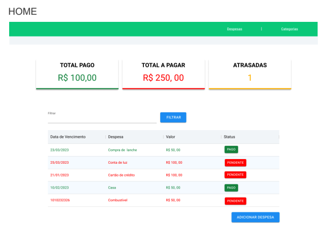
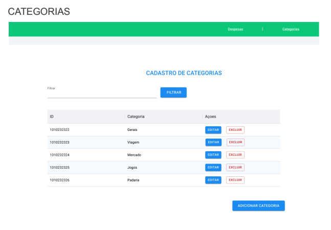

# Projeto controle de despesas
## Sobre o projeto

Um cliente nos procurou para criar um controle de despesas online, onde ele
pudesse inserir despesas de forma categorizada e controlar quais foram pagas ou não.

Nosso cliente deseja ter liberdade para criar as próprias categorias no sistema,
assim como deseja que na lista de despesas ele possa fazer filtros de forma simples e
objetiva. Ele deseja também ter informações chaves em forma de card no início da
aplicação, tais como: Total pago, Total a pagar e quantidade de contas vencidas.

## HOME

### Entregas esperadas:
* A tela home deve conter os totalizadores conforme indicação do cliente
* Deverá carregar todas as despesas cadastradas e possibilitar a filtragem do conteúdo
* Ao clicar no botão(label) de status deve alterar o status da despesa.
* As despesas com status “PAGO” devem estar na cor verde indicada.
* As despesas com status “PENDENTE” devem estar na cor vermelha indicada.
* Ao clicar em “ADICIONAR DESPESA” Você deve abrir a tela com o formulário de adição de despesas
* O header com os menus “Despesas” e “Categorias” devem navegar para suas distintas telas
* O campo filtrar deve conseguir filtrar por todas as colunas, com base no parâmetro “Contém”
### Entregas acima da média:
* Montar uma funcionalidade de exclusão de despesa, se quiser pode se basear na tela de categorias onde esta função é exigida ou pode usar a criatividade.

## ADICIONAR DESPESA

### Entregas esperadas:
* O campo de “Categoria” deve buscar o registro de categorias para o cliente selecionar, fique livre para fazer como achar mais adequado.
* Valide a inserção dos dados conforme o tipo que deve ser aceito
* Ao clicar em salvar você só deve salvar se tudo estiver preenchido de forma adequada.
* Ao clicar no cancelar deve retornar a tela de HOME.
### Entregas acima da média:
* A busca de categorias pode ser construída no estilo auto-complete.
* Ter máscara para formatação de datas e valor.

## CATEGORIAS

### Entregas esperadas:
* A tela de categorias deverá listar todas as categorias cadastradas.
* O filtro deverá efetuar a busca na lista renderizada.
* Ao clicar no editar o usuário deverá acessar a tela de editar categorias.
* Quando o usuário clicar em excluir, deverá exibir um “confirm” se realmente deseja concretizar a exclusão.
### Entregas acima da média:
* Exibir mensagens tratadas de exclusão de forma bonita usando manipulação do
DOM.

## ADIÇÃO/EDIÇÃO DE CATEGORIAS

### Entregas esperadas:
* Criar um formulário para inclusão de categorias.
* Verificar se o campo está preenchido antes de salvar o dado.
* Verificar se a categoria já existe e dar um retorno para o usuário.
* Cancelar deve voltar a exbir a tela de Categorias.
### Entregas acima da média:
* Exibir mensagens tratadas de inclusão de forma bonita usando manipulação do DOM
